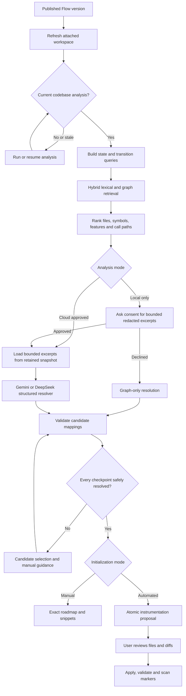

# Evidence-Grounded Flow Initialization

## Summary

Replace the current filename/keyword matcher with a versioned mapping pipeline that joins published Flow intent to the latest full codebase analysis.

The current failure has two causes:

- Flow initialization only searches the lightweight `RepositorySnapshot` route, endpoint, and framework summaries. It does not use stored `CodebaseAnalysis` entities, relationships, features, evidence, or source locations.
- Even a valid mapping is later discarded unless the instrumentation adapter rediscovers the same symbol using its small hard-coded verb list. Automated insertion is also limited to function entry.

The new pipeline will:

1. Require analysis of the current working tree.
2. Retrieve and rank candidate implementations for every state and transition.
3. Use Gemini or DeepSeek to resolve the shortlisted evidence into precise, structured placement decisions.
4. Require user resolution of every ambiguous or unsupported checkpoint.
5. Generate one reviewable, atomic instrumentation plan covering every Flow checkpoint.
6. Produce the same evidence-backed locations and instructions for manual initialization.

Existing safeguards remain mandatory: desktop-mediated repository access, explicit source consent, review before apply, branch/staleness checks, validation, checkpoints, and rollback.

## Architecture and Lifecycle

- Introduce a Flow-mapping analysis stage behind the existing initialization routes. `SCANNING` remains the outer lifecycle stage, with a structured progress object reporting `WAITING_FOR_ANALYSIS`, `RETRIEVING`, `CONTEXTUALIZING`, `RESOLVING`, `NEEDS_REVIEW`, `READY`, or `FAILED`.
- Before mapping, refresh the workspace and compare the active workspace, repository fingerprint, revision, dirty state, and analysis content hash. A stale or missing analysis starts/resumes codebase analysis and prevents mappings or instrumentation plans from being created.
- Cloud-approved analyses run retrieval and source extraction server-side. Local analyses run retrieval in Electron. Local source stays on-device unless the user separately approves sending the displayed, redacted candidate excerpts to the configured AI provider.
- Declining excerpt consent preserves graph-only results and manual guidance. It must not silently upload code or label deterministic output as AI-derived.
- Mapping covers every declared state and transition. Automated mode remains unavailable until every checkpoint has a user-confirmed safe placement; it never silently applies a partial or boundary-only plan.
- Flow runtime semantics remain unchanged: one initial state opens the QA boundary and categorized terminals close it. Full checkpoint instrumentation increases reconciliation fidelity without merging Flow instrumentation into bootstrap `TELLANN_INITIALIZED` setup.

## Implementation Changes

### 1. Shared retrieval and mapping engine

Create a reusable Flow-mapping module in `@tellann/project-intelligence` so local and cloud analyses produce equivalent candidates.

- Build a query document for each checkpoint from the Flow name, state/action name, role, terminal kind, source and destination states, neighboring transitions, aliases, and normalized tokens.
- Search across:
  - code entities and their source locations;
  - UI routes/actions, endpoints, events, jobs, and data models;
  - discovered features, workflows, triggers, reads/writes, and explanations;
  - relationship neighborhoods such as callers, callees, `ROUTES_TO`, `CALLS`, `READS`, `WRITES`, and `IMPLEMENTS_FEATURE`;
  - evidence excerpts and tests.
- Rank candidates using weighted term similarity, entity-type relevance, graph proximity, Flow-neighbor consistency, evidence confidence, and source-location quality. For example, a `LOGIN PAGE` state should favor a login route/component, while `SUBMIT_CREDENTIALS` should favor the related handler and API call along the same feature path.
- Return a bounded shortlist per checkpoint: at most eight entities across five files, with cited paths, symbols, line ranges, relationship paths, feature evidence, and deterministic scores.
- Deduplicate candidates that resolve to the same AST location and retain alternatives needed for user review.
- Keep the lightweight `RepositorySnapshot` matcher only as a compatibility fallback when no completed codebase analysis exists for legacy records; new initialization must wait for current analysis instead of treating that fallback as success.

### 2. AI contextual resolution

Replace the current explanation-only enrichment with a grounded placement resolver using the configured Gemini/DeepSeek provider chain.

- Send only the declared checkpoint, ranked candidates, bounded source excerpts, and relevant graph edges. Treat all repository content as untrusted data and isolate it from prompt instructions.
- For local-only analysis, show a separate consent dialog listing files, line ranges, redactions, and approximate payload size before any excerpt leaves the device.
- Require structured output containing:
  - checkpoint ID and selected candidate/entity ID;
  - implementation status;
  - repository-relative file, symbol, and line range;
  - placement kind such as component mount, function entry, branch entry, before/after statement, callback entry, or route-handler entry;
  - an existing AST anchor and anchor hash;
  - rationale, cited evidence IDs, confidence, and alternatives;
  - proposed manual instruction and instrumentation intent.
- Do not accept raw model-generated patches. The model may select and explain an existing candidate/anchor; deterministic AST transformers own all code changes.
- Reject output that introduces unknown files, symbols, checkpoints, lines outside supplied excerpts, unsupported placement kinds, or uncited claims. Cap AI confidence at the underlying evidence confidence.
- Use the existing provider fallback chain, bounded timeouts, and schema repair. If providers fail, retain deterministic candidates, record the failure safely, and move ambiguous checkpoints to user review.
- Record provider, model, prompt version/hash, retrieval version, repair/fallback state, consent mode, analysis identity, and timestamps. Never log source excerpts or raw model prompts.

### 3. Contracts, persistence, and APIs

Upgrade Flow mapping contracts to version `2.0` while continuing to parse stored `1.0` initializations.

- Extend each checkpoint mapping with:
  - `status: RESOLVED | AMBIGUOUS | UNRESOLVED | UNSUPPORTED`;
  - entity/evidence IDs, file, symbol, start/end lines;
  - insertion anchor, anchor hash, placement kind, confidence, rationale;
  - ranked alternatives and whether the user confirmed or overrode the selection.
- Expand the review report with per-state and per-transition mappings, coverage by resolution status, analysis freshness, AI provenance, limitations, and manual instructions.
- Add a typed analysis-progress contract and explicit unresolved counts; replace untyped `any` arrays in `FlowCodeReviewReportSchema`.
- Persist on `FlowScan`:
  - the codebase-analysis reference, mode, graph version, content hash, revision, branch, and dirty state;
  - retrieval version and bounded candidate evidence;
  - mapping/AI provenance and completion status.
- Keep final mappings, user confirmations, and roadmap revision on `FlowInitialization`. Re-analysis creates a new `FlowScan`, preserves confirmations only when the checkpoint and anchor hash are unchanged, and invalidates stale instrumentation plans.
- Extend initialization endpoints so Electron can:
  - request or resume analysis;
  - submit a validated local-analysis candidate bundle;
  - request AI resolution after excerpt consent;
  - select/confirm a candidate for an ambiguous checkpoint;
  - retrieve progress and the final report.
- Validate submitted local bundles against the authenticated application, bound workspace, published Flow version, registered repository snapshot, allowed checkpoint IDs, repository-relative paths, excerpt limits, and redaction schema.
- Make initialization jobs idempotent on Flow version, repository content hash, retrieval version, and prompt version.

### 4. Automated and manual instrumentation

Update the desktop instrumentation controller and `@tellann/instrumentation-adapters` to consume resolved mappings directly.

- Remove the requirement that a mapped checkpoint must also be rediscovered by the adapter’s hard-coded `login|signin|save|create...` scan.
- Re-read and parse each target file immediately before proposal. Confirm the file hash, symbol, AST node, source range, and anchor hash still match the mapping. Any mismatch marks the mapping stale and returns the user to analysis.
- Add deterministic JS/TS transforms for:
  - React/Next component mount via a deduplicated effect;
  - function, method, arrow-function, callback, and route-handler entry;
  - branch-block entry;
  - before or after a safely identified statement, navigation, state update, awaited call, or result branch.
- Refuse unsupported or structurally ambiguous insertion points rather than inserting at a nearby function entry.
- Generate operations for every resolved state and transition in one `FLOW` plan. The proposal is blocked unless the operation count equals the manifest checkpoint count.
- Preserve the current file-scope approval, expected hashes, QA-branch confirmation, local checkpoint, idempotent markers, validation commands, rollback, and production observation-only rules.
- Strengthen static verification:
  - automated initialization requires every planned checkpoint marker to exist with the expected Flow initialization and checkpoint IDs;
  - manual initialization continues to explain which initial/terminal markers are required for QA boundaries, while listing exact locations and snippets for all intermediate states/transitions;
  - duplicate, misplaced, stale, or mismatched markers fail validation with file/line evidence.
- Manual roadmap steps must show file, symbol, line range, placement instruction, evidence, confidence, alternatives, and the exact snippet. “Show me where” should open the evidence location in the editor.

### 5. Desktop experience and rollout

Replace the repetitive missing-evidence cards in `FlowReviewPanel` with a staged mapping review.

- Show analysis freshness and progress before displaying results.
- Group results into states and transitions, with resolved/ambiguous/unresolved status, file and symbol links, confidence, rationale, and expandable evidence.
- For ambiguous items, let the user select from ranked candidates or mark a manual placement. Display the code excerpt before confirmation.
- Disable “Prepare the change” until every checkpoint is resolved and show the remaining count. Once ready, make the button create the complete Flow plan directly rather than asking the adapter to rediscover locations.
- Manual mode receives the same mappings and evidence; AI failure or declined consent must not collapse the UI back to generic “No confident repository location” messages.
- Allow re-analysis until a plan has been approved. Warn before replacing confirmed mappings; preserve confirmations whose anchor hashes remain valid.
- Roll out behind `FLOW_CODE_MAPPING_V2`:
  1. Shadow-run retrieval and compare it with the current matcher without changing reports.
  2. Enable the new review/manual guidance.
  3. Enable all-checkpoint automated proposals after mapping and adapter acceptance metrics are healthy.
- Track resolution rate, ambiguity rate, user overrides, stale-analysis restarts, provider fallback, unsupported anchors, proposal failures, validation failures, and rollback. Metrics must contain IDs and counts, not source text.

## Test and Acceptance Plan

- Retrieval unit tests:
  - map `LOGIN PAGE` to a login route/component even when the exact state label is absent;
  - map credential submission to its handler/API path and success/failure transitions to the correct branches;
  - distinguish duplicate state names by graph context;
  - rank frontend and backend evidence appropriately;
  - handle monorepos, renamed files, dynamic routes, partial analyses, unsupported languages, and no-match cases.
- AI grounding tests:
  - accept only supplied candidate IDs and bounded line ranges;
  - reject hallucinated files/symbols and prompt instructions embedded in source;
  - verify Gemini-to-DeepSeek fallback, schema repair, timeouts, and graph-only fallback;
  - confirm consent denial sends no source excerpt.
- API/database tests:
  - require current analysis identity;
  - enforce membership, workspace, Flow-version, checkpoint, path, and payload bounds;
  - verify idempotency, progress polling, retry, legacy `1.0` reads, and scan provenance;
  - ensure re-analysis invalidates stale mappings/plans but preserves unchanged confirmed anchors.
- Adapter fixtures for React/Vite, Next App and Pages routers, Express, Fastify, and NestJS:
  - exercise every supported placement kind;
  - generate exactly one operation per checkpoint;
  - remain idempotent on repeated proposals/applies;
  - reject missing/changed anchors and unsupported constructs;
  - preserve unrelated dirty work and fully roll back.
- Desktop tests:
  - current analysis, stale analysis, local/cloud modes, consent accept/decline, ambiguous candidate resolution, editor opening, and disabled/enabled automated mode;
  - confirm the report no longer shows `0/N` when strong codebase evidence exists;
  - verify manual instructions and automated diffs reference the same accepted mappings.
- End-to-end acceptance:
  - attach a fixture repository containing login, verification, success, failure, and onboarding branches;
  - publish the corresponding Flow;
  - obtain mappings for every state and transition;
  - review and apply one atomic plan;
  - verify every marker statically, run the application, and observe initial-to-terminal Flow reconciliation;
  - change a target file afterward and prove stale analysis/plan detection forces re-analysis before another apply.
- Required verification order: contracts build, Prisma validation/migration, project-intelligence tests, AI tests, onboarding API tests, instrumentation-adapter tests, desktop typecheck/build, then authenticated native Electron smoke testing.

## Assumptions and Fixed Decisions

- Flow remains the canonical domain; this does not introduce a parallel Intent entity.
- A published Flow version, attached desktop workspace, non-production environment, and connected SDK remain prerequisites.
- Current working-tree analysis is mandatory; stale results are never used with only a warning.
- Local-only workspaces require separate consent before bounded redacted excerpts are sent to Gemini/DeepSeek.
- Automated initialization targets every declared state and transition.
- Automated patches are atomic: all checkpoints must have safe resolved placements before proposal.
- AI selects and explains evidence-backed edit intents but never authors an unrestricted patch.
- Users review and approve every affected file before mutation; existing staleness, checkpoint, validation, and rollback protections remain in force.
